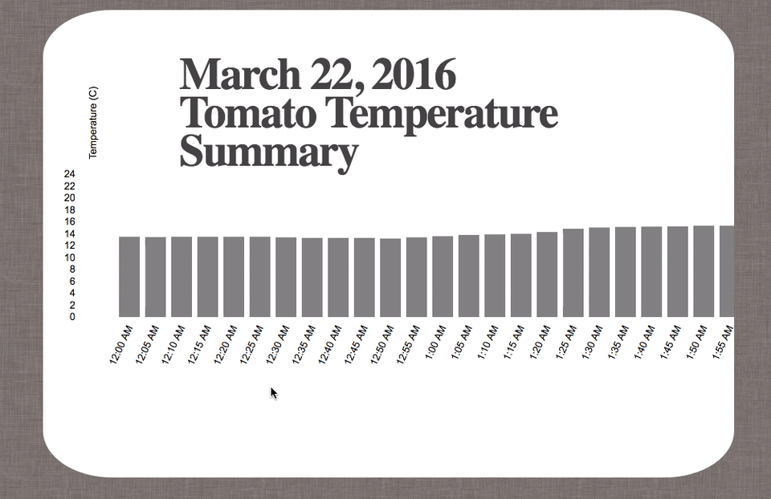
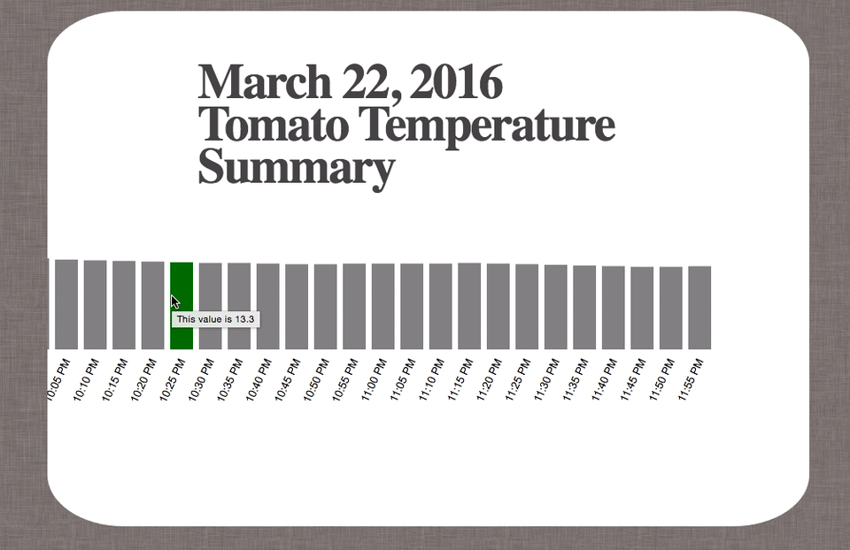

# tomato_greenhouse

####The website is live [here](http://kaira.one/tomato_greenhouse)

A project for [Agrilyst](http://agrilyst.com/).

A D3.js visualization that utilizes data from a tomato greenhouse farm. Since this is my first D3.js application,
I kept the reponse variable to one, which is temperature. The <strong>y</strong> variable is plotted against time (<strong>x</strong>).
Data was logged every five minutes starting from 12:00 am and ending at 11:55 pm.

